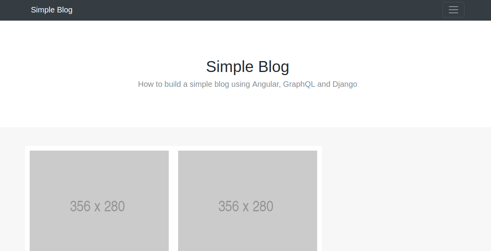

simple blog
===========


[A simple blog website powered by GraphQL, Django & Angular](https://medium.com/@nioperas06/how-to-build-a-simple-blog-using-angular-graphql-and-django-2fbc76d91c6d)


# Getting started

Clone the repository
 ```
  $ git clone git@github.com:nioperas06/graphql-angular-django-simple-blog.git
 ```
Run Django GraphQL API
```
 $ cd graphql-angular-django-simple-blog/graphql_api
 $ pip install -r requirements.txt
 $ python manage.py runserver
```
Launch Angular App
```
 $ cd graphql-angular-django-simple-blog/angular-app
 $ npm install
 $ ng serve -o
```
